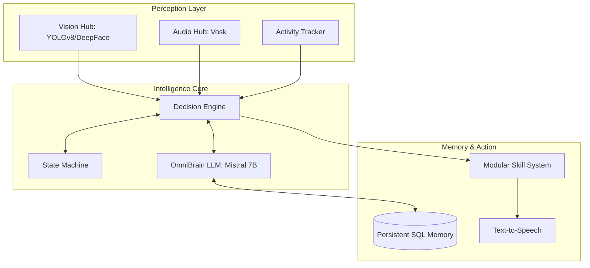

# 🤖 J.A.R.V.I.S. Autonomous Companion v4.0


> *"Welcome home, Sir. All systems are operational and the environment has been synchronized."*

**J.A.R.V.I.S.** (Just A Rather Very Intelligent System) is a local-first, autonomous personal intelligence system. It isn't just a chatbot; it's a desktop-integrated entity that perceives its environment, tracks your productivity, and assists through a modular skill system.

---

## 🌌 System Architecture

Jarvis operates on a **Perception-Reasoning-Action** loop, coordinated by a high-performance event bus.



---

## ✨ Key Features

### 👁️ Strategic Vision (Optics)
*   **Neural Object Detection:** Powered by **YOLOv8** for real-time identification of 80+ object classes.
*   **Biometric Emotion Analysis:** Utilizes **DeepFace** to gauge user mood and presence.
*   **Spatial Hand Tracking:** **MediaPipe** integration for gesture recognition and interactive finger counting.
*   **Tactical HUD:** A real-time visual overlay providing live telemetry of everything Jarvis sees.

### 🧠 OmniBrain Intelligence
*   **Local LLM Reasoning:** Powered by **Ollama (Mistral 7B)** for private, offline, high-fidelity reasoning.
*   **Global Datastream:** Real-time web search integration via **DuckDuckGo** for news, weather, and facts.
*   **Contextual RAG:** Short-term and long-term memory systems ensure Jarvis remembers past interactions and preferences.
*   **Proactive Engagement:** Jarvis doesn't just wait; he monitors your activity and checks in if you're stuck or idle.

### � Sonic Presence
*   **Vosk Acoustic Core:** High-accuracy local speech recognition tuned for Indian English accents.
*   **Self-Deafness Protocol:** Advanced filtering so Jarvis never listens to himself.
*   **Expressive TTS:** Custom-tuned speech synthesis for a natural, sophisticated personality.

### 🛠️ The Skill System (Modular)
Jarvis is infinitely extensible. Current protocols include:
*   **AppLauncher:** Voice-activated control for software and directories.
*   **SystemHealth:** Real-time monitoring of CPU, RAM, and thermals.
*   **Automation:** Scripting and workflow automation via the **AutomationEngine**.
*   **MediaControl:** Seamless management of system audio and playback.

---

## 📂 Project Structure

```text
jarvis/
├── core/                   # The Intelligence Core
│   ├── agent_loop.py       # Main orchestration loop
│   ├── decision_engine.py  # High-level logic & routing
│   ├── event_bus.py        # Inter-component communication
│   └── skills/             # Modular capabilities (19+ plugins)
├── perception/             # Sensor Inputs
│   ├── perception_layer.py # Vision/Biometric hub
│   └── audio_listener.py   # Speech recognition
├── personality/            # Identity & Response logic
├── action/                 # Output execution (TTS/Automation)
├── memory/                 # SQL & RAG Storage
├── config/                 # YAML Configuration
└── models/                 # Local AI Model Weights
```

---

## 🚀 Deployment Guide

### 1. Prerequisites
*   **OS:** Windows 10/11 (Optimized for PowerShell)
*   **Hardware:** 8GB+ RAM (16GB recommended for LLM)
*   **Engine:** [Ollama](https://ollama.com/) installed and running.

### 2. One-Click Setup
Clone the repository and run the automated setup script to synchronize dependencies and download neural weights:

```powershell
git clone https://github.com/Smit-2907/Jarvis.git
cd Jarvis
./setup.ps1
```

### 3. Manual Initialization
If you prefer manual control using [uv](https://github.com/astral-sh/uv):

```powershell
uv sync
uv run main.py
```

---

## 💬 Tactical Interactions

*   **Logic:** *"Jarvis, analyze the current market trends of semiconductor industry."*
*   **Vision:** *"Scan the room and identify any potential distractions."*
*   **Utility:** *"Open VS Code and set a focus timer for 45 minutes."*
*   **Status:** *"System health check. Tell me the CPU load."*

---

## 🔒 Privacy First

Jarvis is designed with privacy as the primary directive.
*   **Zero Cloud:** All voice, face, and activity data stays on your machine.
*   **Open weights:** Uses open-source models (YOLO, Mistral, Vosk).
*   **Transparent:** All "thoughts" and detections are logged locally for your review.

---

<p align="center">
  <i>"I have all of a human's sophistication with none of the biological overhead."</i><br>
  <b>Built by Smit | J.A.R.V.I.S. Project</b>
</p>
